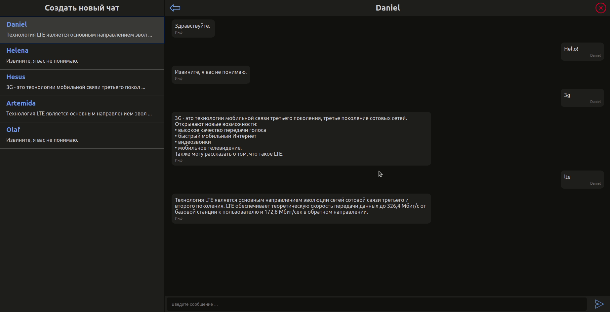

# CHAT API UI

Тестовый проект для "Лаборатория Наносемантика".
Пользовательский интерфейс для работы с CHAT API.

## Интерфейс

### Создание чата

Нажмите кнопку "Создать новый чат" и заполните данные формы

### Валидация формы создания чата

В форме есть простая валидация:
- Все поля должны быть заполнены
- Имя должно состоять из букв
- Возраст должен быть в пределах от 8 до 120 лет

### Отправка сообщения

При первом входе в чат, происходит инициализация чата. Отправляется запрос на сервер и бот выдает приветственное сообщение. После этого можно начинать общение.

Для отправки сообщения введите сообщение в инпут и нажмите кнопку отправить (отправка сообщения по нажатию на клавишу enter не добавлена).

Бот дает развернутый ответ только на два вида сообщений: "3g" и "lte".
На все остальные сообщения бот отвечает: "Извините, я вас не понимаю."

### Смена чата

Вы можете сменить чат кликая по элементам в списке чатов (левое меню)

Для того, чтобы выйти из чата, нажмите кнопку назад

### Очистка истории

Для очистки истории чата нажмите кнопку удалить (в правом верхем углу).
Осторожно! Данное действие невозможно будет отменить

## Задания:

### Интерфейс должен включать в себя:
- [x] строку ввода сообщения,
- [x] кнопку отправки сообщения,
- [x] кнопку перезапуска разговора в новой сессии с удалением истории текущего диалога,
- [x] историю текущего диалога (сохраняется при перезапуске).

### Пожелание (будет плюсом, но необязательно ):

- [x] Для реализации проекта следует создать отдельный репозиторий;
- [x] Выполнить задание с использованием React;
- [x] Концептуально продумать и разработать UI (user interface);
- [ ] Настроить сборку на webpack самостоятельно (не использовать CRA).
- [x] Использовать localStorage для хранения данных

## Основные команды

### `yarn start`

Dev mode
[http://localhost:3000](http://localhost:3000) для просмотра в браузере с локальной машины
[http://192.168.1.70:3000](http://192.168.1.70:3000) для просмотра в браузере в локальной сети

### `yarn build`

Сборка проекта в папку `build`
